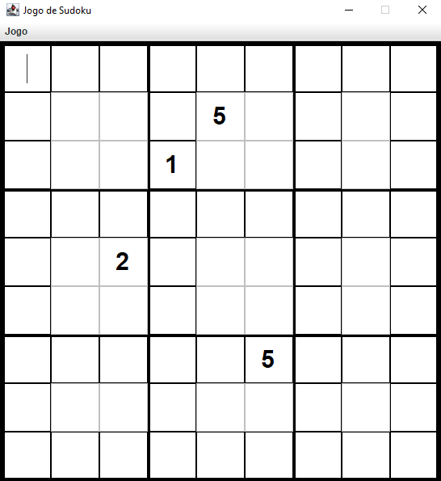

# Jogo de Sudoku - Java Swing

  

## 📌 Sobre o Projeto

Este projeto implementa o clássico jogo de Sudoku usando Java com Swing para a interface gráfica. Ele oferece uma experiência interativa com recursos como rascunhos, verificação de erros, reinício do jogo e finalização quando estiver completo.

## 🚀 Funcionalidades

- 🎨 Interface gráfica 9x9 com Java Swing  
- 🆕 Novo jogo com números fixos preservados  
- 🔢 Inserção e remoção de números  
- ✍️ Rascunhos visuais (pencil marks)  
- 👀 Visualizar estado atual do jogo  
- ✅ Verificar status do jogo (completo, incompleto ou com erros)  
- 🧹 Limpar apenas os números do jogador  
- 🏁 Finalizar jogo com validação da solução  
- ❌ Destaque de erros (linhas, colunas ou blocos com duplicação)

## 🖥️ Requisitos

- Java Development Kit (JDK) 8 ou superior  
  [Baixe aqui](https://adoptium.net/) se ainda não tiver instalado.

## ⚙️ Como Rodar

1. **Clone o repositório:**
   ```bash
   git clone https://github.com/SEU_USUARIO/sudoku-game.git
   cd sudoku-game

2. Compile o projeto:

javac src/com/sudoku/main/SudokuGame.java

3. Execute o jogo:

java -cp src com.sudoku.main.SudokuGame

4. Opcional - iniciar com números fixos:
Use argumentos no formato numero:linha:coluna, por exemplo:

java -cp src com.sudoku.main.SudokuGame 5:0:0 3:0:1 7:0:4 6:1:0

## 🕹️ Como Jogar
Use o menu “Jogo” na interface para interagir com o jogo:

- Iniciar Novo Jogo: limpa o tabuleiro mantendo os números fixos
- Colocar/Remover Número: insira ou apague valores específicos
- Colocar/Remover Rascunho: adicione ou retire notas pequenas
- Visualizar Jogo: mostra o tabuleiro atual
- Verificar Status: checa erros e se está completo
- Limpar Números do Jogador: remove apenas o que você inseriu
- Finalizar Jogo: só finaliza se o tabuleiro estiver correto

## 🤝 Contribuindo
Quer melhorar o projeto? Fique à vontade para:

- Fazer um fork
- Criar uma issue
- Enviar um pull request

Feito com ☕ e Swing ❤️
